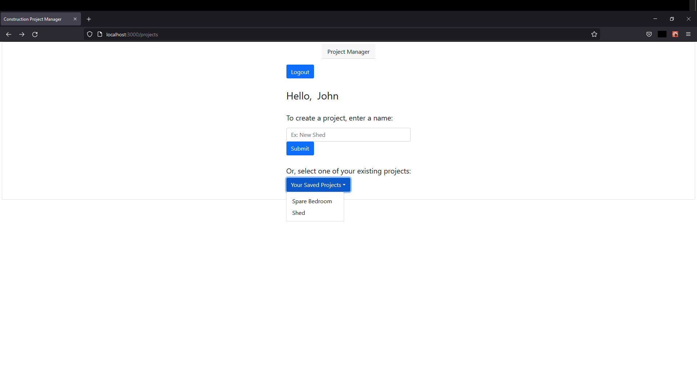
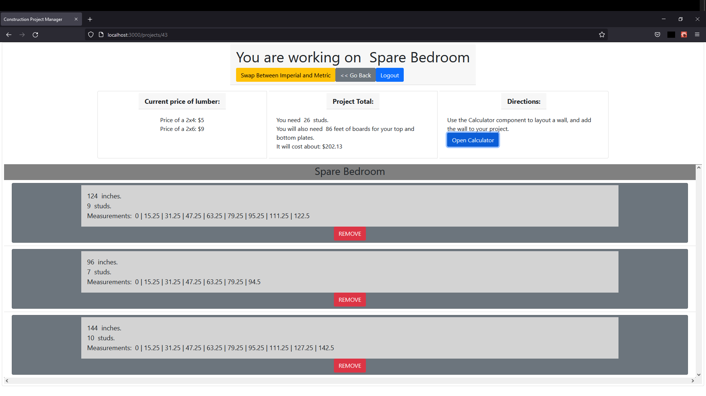
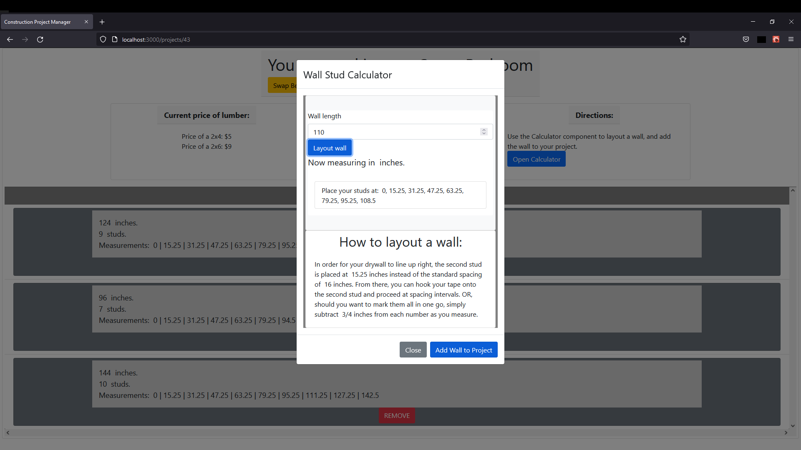

# Construction Project Manager

- Version 0.8: Bugfixes and finalization of project structure.
- Version 0.7: Reworking app flow.
- Version 0.6: API schema being finalized using JWT for authorization.
- Version 0.5: successful integration with server.

A simple tool for carpenters. It will take the frustration out of laying out your wall by telling you exactly where to mark your lines, and how much lumber you'll need.
Built using React hooks and functional components, styled using react-bootstrap, using Node.js, Express.js, and PostgreSQL for back end.

## API Schema:

### /users/login & /users/register

These routes are used to login existing users, and to post new users to the database. A JWT is issued, which stores only the user's unique id. This id value is used in the relational database for project creation and retrieval.

### /users/verify

Compares values received from the login component to the values stored in the database.

### /users/current

GETs the authenticated user's name.

### /projects

GET and POST projects using user id.

### /walls

GET, POST and DELETE walls using project id.
