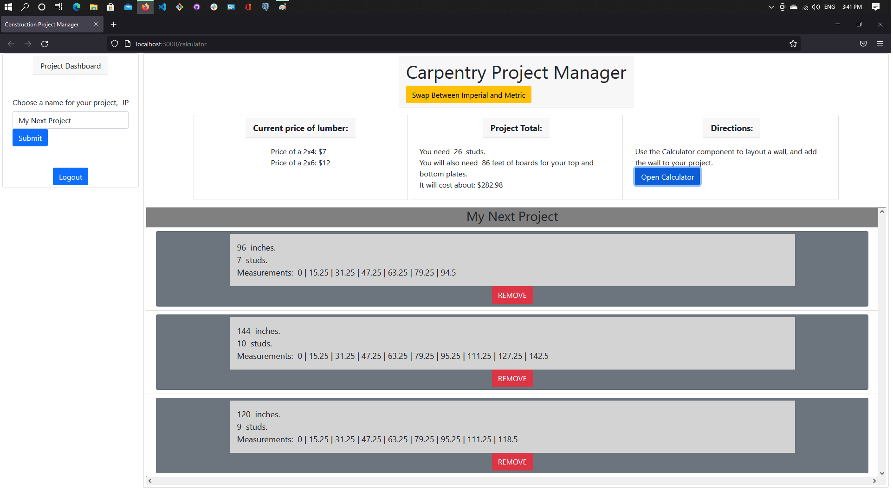
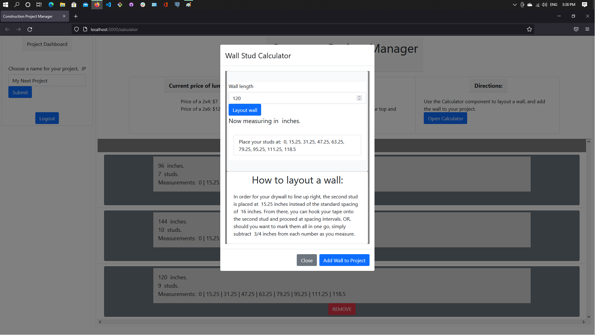

# Construction Project Manager
version 0.6: API schema being finalized using JWT for authorization.
version 0.5: successful integration with server.

A simple tool for carpenters. It will take the frustration out of laying out your wall by telling you exactly where to mark your lines, and how much lumber you'll need. 
Built using React hooks and functional components, styled using react-bootstrap, using Node.js, Express.js, and PostgreSQL for back end.

## API Schema:
### /users 
This route is used to login existing users, and post new users to the database. A JWT is issued, which stores only the user's unique id. This id value is used in the relational database for project creation and retrieval.
### /users/name 
